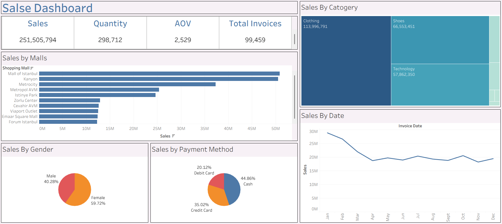

# 🛍️ Retail Sales Dashboard | Tableau Project

## 📌 Project Overview

This project presents an interactive **Retail Sales Dashboard** built using **Tableau** to analyze customer shopping behavior, sales performance, payment preferences, category-wise revenue, and shopping mall performance.

The dashboard provides business stakeholders with a clear overview of sales trends and customer purchasing patterns, enabling data-driven decision-making.

---

## 📊 Dashboard Preview



---

## 🎯 Business Objective

The main objective of this dashboard is to:

- Monitor overall sales performance.
- Identify top-performing shopping malls.
- Analyze category-wise sales contribution.
- Understand customer demographics.
- Evaluate payment method preferences.
- Track monthly sales trends.
- Support strategic business decisions through visual analytics.

---

## 📂 Dataset Information

**Dataset Name:** Customer Shopping Data

### Features Included

| Column Name | Description |
|------------|-------------|
| Invoice No | Unique invoice identifier |
| Customer ID | Unique customer identifier |
| Gender | Customer gender |
| Age | Customer age |
| Category | Product category purchased |
| Quantity | Quantity purchased |
| Price | Purchase amount |
| Payment Method | Cash, Credit Card, Debit Card |
| Invoice Date | Transaction date |
| Shopping Mall | Mall where purchase occurred |

### Dataset Summary

- Total Records: **99,459**
- Total Customers: **99,459 Transactions**
- Categories Analyzed: Multiple retail categories
- Payment Methods: Cash, Credit Card, Debit Card
- Shopping Malls: 10+ Major Shopping Malls

---

# 📈 Key Performance Indicators (KPIs)

The dashboard highlights the following KPIs:

| KPI | Value |
|------|--------|
| Total Sales | 251,505,794 |
| Total Quantity Sold | 298,712 |
| Average Order Value (AOV) | 2,529 |
| Total Invoices | 99,459 |

---

# 📊 Dashboard Components

## 1️⃣ Sales KPI Cards

Provides a quick snapshot of:

- Total Revenue
- Total Quantity Sold
- Average Order Value
- Total Invoices Generated

These metrics help management monitor overall business performance at a glance.

---

## 2️⃣ Sales by Shopping Mall

### Purpose
Analyze revenue generated by each shopping mall.

### Key Insights

Top-performing malls include:

1. Mall of Istanbul
2. Kanyon
3. Metrocity
4. Metropol AVM
5. Istinye Park

### Business Value

- Identifies high-performing locations.
- Helps allocate marketing budgets effectively.
- Supports expansion planning.

---

## 3️⃣ Sales by Category (Treemap)

### Purpose

Visualize category-wise contribution to total sales.

### Major Revenue Contributors

- Clothing
- Shoes
- Technology

### Business Value

- Helps identify profitable product segments.
- Assists inventory planning.
- Supports category growth strategies.

---

## 4️⃣ Sales by Gender

### Distribution

| Gender | Percentage |
|----------|------------|
| Female | 59.72% |
| Male | 40.28% |

### Key Insight

Female customers contribute the majority of transactions and sales activity.

### Business Value

- Enables targeted marketing campaigns.
- Helps understand customer demographics.

---

## 5️⃣ Sales by Payment Method

### Distribution

| Payment Method | Percentage |
|---------------|------------|
| Cash | 44.86% |
| Credit Card | 35.02% |
| Debit Card | 20.12% |

### Key Insight

Cash remains the most preferred payment method among customers.

### Business Value

- Helps optimize payment infrastructure.
- Supports customer payment behavior analysis.

---

## 6️⃣ Monthly Sales Trend

### Purpose

Track sales performance over time.

### Observations

- Strong sales performance during the beginning of the year.
- Slight decline observed in later months.
- Stable revenue trend throughout the year.

### Business Value

- Identifies seasonality patterns.
- Helps forecast future sales.
- Supports strategic planning.

---

# 🔍 Insights Derived

### Customer Insights

- Female shoppers account for nearly 60% of purchases.
- Cash transactions dominate payment preferences.

### Sales Insights

- Clothing is the highest revenue-generating category.
- Mall of Istanbul generates the highest sales.
- Sales remain relatively stable after the first quarter.

### Business Recommendations

✅ Increase inventory for top-performing categories.

✅ Launch targeted campaigns for female customers.

✅ Introduce loyalty programs at high-performing malls.

✅ Encourage digital payments through cashback offers.

✅ Focus marketing efforts during lower-performing months.

---

# 🛠️ Tools & Technologies Used

| Tool | Purpose |
|--------|----------|
| Tableau | Dashboard Development |
| CSV Dataset | Data Source |
| Excel / Data Preparation | Data Cleaning |
| Data Visualization | Business Analytics |

---

# 📋 Tableau Features Used

- KPI Cards
- Treemap
- Pie Charts
- Bar Charts
- Line Charts
- Filters
- Interactive Dashboard Layout
- Aggregated Measures
- Calculated Fields

---

# 📁 Project Structure

```
Retail-Sales-Dashboard/
│
├── Dashboard/
│   ├── Sales Dashboard.twb
│   └── Sales Dashboard.twbx
│
├── Dataset/
│   └── customer_shopping_data.csv
│
├── Images/
│   └── dashboard.png
│
├── README.md
│
└── Documentation/
    └── Project_Report.pdf
```

---

# 🚀 How to Use

### Step 1

Clone the repository:

```bash
git clone https://github.com/yourusername/retail-sales-dashboard.git
```

### Step 2

Open Tableau Desktop.

### Step 3

Load the dataset:

```text
customer_shopping_data.csv
```

### Step 4

Open:

```text
Sales Dashboard.twbx
```

### Step 5

Interact with filters and visualizations to explore insights.

---

# 📸 Dashboard Highlights

### Executive Summary

✔ Revenue Overview

✔ Shopping Mall Performance

✔ Category Analysis

✔ Customer Demographics

✔ Payment Preferences

✔ Monthly Sales Trends

---

# 📌 Future Enhancements

- Profit Analysis Dashboard
- Customer Segmentation
- Geographic Sales Analysis
- Forecasting Models
- Cohort Analysis
- Customer Lifetime Value (CLV)
- Advanced Tableau Storyboards

---

# 👨‍💻 Author

**Shubham Dalvi**

M.Sc. Computer Science  
Aspiring Data Analyst | Python | SQL | Tableau | Power BI

### Skills

- Data Analysis
- Data Visualization
- Tableau
- Power BI
- SQL
- Python
- Excel

---

# ⭐ If you found this project useful

Please consider giving this repository a **Star ⭐** on GitHub.
